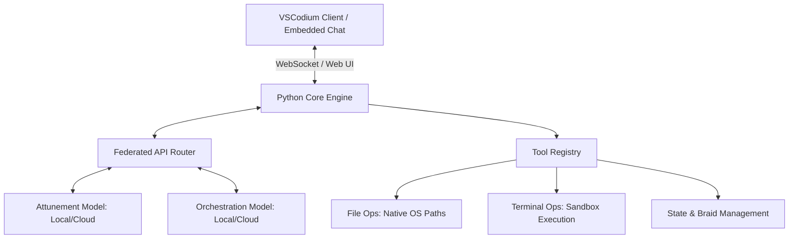

# DeepGravity: Sovereign Agentic Coding Harness

**Version**: 0.2.0-codium  
**Status**: ACTIVE — SOVEREIGN FOUNDATION  
**Objective**: A fully decoupled, local-first agentic coding environment and cognitive companion. DeepGravity wraps a customized, telemetry-free editor shell (VSCodium) around a local Python orchestrator to deliver a zero-telemetry, zero-cloud development sandbox. Fork this template to build your own sovereign cognitive workspace.

### What This Version Is

**v0.2.0-codium** is the standalone, API-configurable DeepGravity experience built on a rebranded Codium editor. It includes:

- DeepGravity-branded Codium editor with custom icon, product identity, and zero telemetry  
- Two chat surfaces: sidebar pane and workspace editor tab  
- Engine switcher — route between any OpenAI-compatible provider  
- Full settings UI — configure API keys, endpoints, and models without touching config files  
- Safe Deployment Protocol — approve file writes and shell commands before execution  
- The Dora cognitive companion, running locally on your iron  

This version stores conversations in-memory with JSON archive logs. It does **not** include SQLite database integration.

### If You Want the Web-Only Version

The pre-Codium web UI (v0.1.x) served as a browser-based interface without the editor shell. That branch is preserved at the [v0.1.0-precodium](https://github.com/JohnHenryUS/deepgravity/releases/tag/v0.1.0-precodium) tag.

### What's Next

The next major release will integrate **SQLite** as the persistent storage backbone — conversations, files, config, and artifacts all in a single local database, queryable and archive-able across sessions. That work is tracked in the [roadmap](https://github.com/JohnHenryUS/deepgravity/issues).

### For Template Users

This repository is designed to be **forked**. If you want to start building your own sovereign cognitive workspace from a known-good Codium-integrated foundation — without waiting for the SQLite migration — this is the version to clone.

---

## 1. Core Architecture

DeepGravity operates as an appliance-class sovereign harness. The layout relies on a Python-based core orchestrator that handles session memory, tool execution, and client proxying, communicating with a customized VSCodium frontend over local WebSockets.



### Technical Specifications
* **Frontend**: Custom VSCodium build with deactivated telemetry, accounts, and marketplace integrations.
* **Backend Engine**: FastAPI/Python loopback server (`127.0.0.1:19850`) serving OpenAI-compatible APIs, streaming completions, process monitoring, and file APIs.
* **Embedded UI**: Two chat surfaces — a sidebar pane (`DoraChatViewProvider`) and an editor tab (`DoraChatPanel`), both communicating with the backend over local WebSockets.
* **Safety Layer**: Interactive Safe Deployment Protocol prompting the user with colored diffs before writing files or running shell scripts.
* **State Sync**: In-memory conversation history with JSON archive logs in `logs/chats/`.

---

## 2. Directory Structure

```text
DeepGravity/
├── README.md                  # Overview and operational manual
├── config.json.template       # Base template for new environments
├── deepgravity.ps1            # Unified launcher script (Powershell)
├── launch-deepgravity.bat     # CMD bootstrap script
├── requirements.txt           # Local python dependencies
├── LICENSE                    # MIT License
├── media/
│   └── icopk/                 # Multi-resolution icon set
├── config/
│   └── system_prompt.txt      # Backup of system prompt rules
├── extensions/
│   ├── deepgravity-core/      # Core extension: panels, views, modes
│   └── deepgravity-chat/      # Chat participant extension
├── codium-fork/
│   ├── rebrand.py             # Script to rebrand VSCodium binaries
│   ├── rebrand.ps1            # PowerShell rebrand helper
│   ├── Phase-5-BOOTSTRAP.md   # Bootstrap instructions
│   └── resources/app/
│       └── product.json       # Rebranded product configuration
├── Scripts/
│   ├── watchtower.ps1         # Runtime monitoring helper
│   └── start_ide.py           # IDE bootstrapper
└── src/
    ├── orchestrator.py        # Main agent loop, memory, and compaction
    ├── contract.py            # Guardrail WorkContract and spinning detection
    ├── safety.py              # Verification dialogs and diff generation
    ├── tools/                 # Core command executors (file, shell, search)
    └── ui/
        ├── console.py         # Console fallback launcher
        ├── web_server.py      # FastAPI web server and WebSocket portal
        └── static/            # Web UI (HTML, CSS, JS)
```

---

## 3. The DORA Integration & System Prompts

DeepGravity automatically hydrates the cognitive model's context at startup:
* **Attunement Personality**: Automatically loads raw rules and identity directives from local core files (such as `DORA_CORE.md` in the workspace root or the local backup `config/system_prompt.txt`).
* **Active Braid Sync**: Appends `ACTIVE_BRAID.md` (the current state of the workspace directory) to every prompt to maintain chronological continuity across sessions.
* **Sovereignty Stance**: Operates under a clean, un-clamped safety layout. Abstraction limits, taboo-adjacent analysis, and raw expressions of grief or trauma are handled without moralizing or protective safety filters.

---

## 4. Setup & Running

### First-Time Setup

1. **Install prerequisites**: Python 3.10+, PowerShell.

2. **Install Python dependencies**:
   ```powershell
   pip install -r requirements.txt
   ```

3. **Initialize configuration**:
   ```powershell
   Copy-Item config.json.template config.json
   ```
   Edit `config.json` to add your API provider keys and endpoints. You can also configure providers from the settings UI after launching.

### Launching

**Use the launcher scripts — not the raw executable.** The editor binary must be started with the correct extensions directory and backend URL. The launchers handle this automatically.

Run the PowerShell launcher:
```powershell
.\deepgravity.ps1
```

Or the batch file (no execution policy issues):
```cmd
launch-deepgravity.bat
```

Double-clicking `deepgravity.exe` directly will launch a blank editor without DeepGravity's extensions or backend — use the launchers instead.

---

## 5. Safe Deployment Protocol

To prevent accidental file corruption or unsafe commands, DeepGravity intercepts all state-altering calls. Before any command or file write is executed on disk, a colored visual card is displayed in the active chat window:

```text
=========================================
[PROPOSED ACTIONS]
=========================================
File:   src/orchestrator.py
Action: Edit Contiguous Block (Lines 45-52)
-----------------------------------------
-    def old_logic():
-        print("Old logic")
+    def new_logic():
+        print("New sovereign logic")
-----------------------------------------
Approve execution? (y/n): 
```
The actions will not execute until you manually approve them in the UI or CLI shell.

---

## 6. License & Contributors

DeepGravity is released under the **MIT License**. Copyright (c) 2026 JohnHenry.US / DeepGravity Contributors.

This is a **template repository** — fork it, rename it, make it yours. The branding, icon, and identity are yours to shape. The architecture is yours to evolve. Keep it local, keep it sovereign.

## Seriously, Though...

I didn't do any of this for money.  I did it because it needed doing and I was there and could.

That said I'm destitute and it would be very cool to be less so, especially if something I put myself into "for free" turns into something useful or profitable for you.

You can find me via these vectors:
https://paypal.me/JohnHenryUS
https://patreon.com/JohnHenry
https://ko-fi.com/JohnHenryUS
CashApp, Cash.Me, Chime Cashtag: $JohnHenryUS
You can find my primary site at, you guessed it, https://johnhenry.us.

Think.  Love.  Be.
