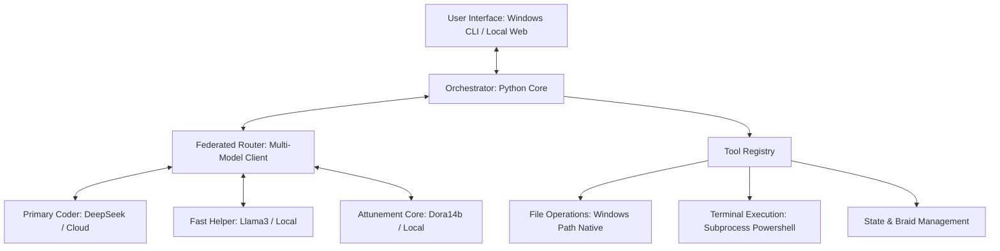

# DeepGravity: Sovereign Agentic Coding Harness

**Version**: 0.1.0-alpha  
**Status**: PLANNING / ARCHITECTURE LOCKED  
**Objective**: Build a local, lightweight, sovereign agentic coding loop that runs natively on Windows/Powershell. The orchestrator must be entirely API-agnostic, supporting both cloud endpoints (DeepSeek, OpenAI, Groq) and local model stacks (Ollama, LM Studio, llama.cpp) via standard OpenAI-compatible API schemas.

---

## 1. Core Architecture

DeepGravity runs natively on the Windows host machine. It consists of a Python-based core orchestrator that manages session memory, tool execution, and a **Federated API Router** that can spin up multiple simultaneous client connections to different local and cloud LLM endpoints.



### Key Technical Specs
*   **Backend**: Python 3.11+ (Windows native)
*   **API Interface**: Federated Router supporting simultaneous client connections (DeepSeek API, Local Ollama, Groq, OpenAI).
*   **Role-Based Routing**: Assigns distinct LLM models to distinct tasks (e.g. cloud coder for heavy edits, local model for rapid file analysis/summaries, attunement model for dialogue and identity compliance).
*   **Target OS**: Windows (native Powershell execution, backslash path normalization)
*   **State Persistence**: Local JSONL transcripts and plain text logs
*   **Safety Layer**: Interactive Safe Deployment Protocol (user diff verification before write/shell commands)

---

## 2. Directory Structure

```text
Projects/DeepGravity/
├── README.md               # This planning file
├── config/
│   ├── system_prompt.txt   # Hydrates Dora Core and Global Rules
│   └── tools_schema.json   # Provider-agnostic function definitions
├── src/
│   ├── __init__.py
│   ├── providers/          # Modular API providers (Local & Cloud)
│   │   ├── __init__.py
│   │   ├── base.py         # Abstract base provider class
│   │   └── openai_compat.py # Universal handler for DeepSeek, Ollama, OpenAI
│   ├── orchestrator.py     # Main agent loop, memory, and compaction
│   ├── safety.py           # Diff verification and user confirmation dialogs
│   ├── tools/
│   │   ├── __init__.py
│   │   ├── file_ops.py     # view_file, write_file, replace_content (Windows native)
│   │   ├── shell.py        # Subprocess shell command execution (Powershell)
│   │   └── search.py       # Grep search and list_dir implementation
│   └── ui/
│       ├── __init__.py
│       └── console.py      # Rich terminal UI or local web server
└── requirements.txt        # local python deps (openai, rich, pydantic, etc.)
```

---

## 3. Tool Specifications

To match the precision of Antigravity, DeepGravity will expose a minimal, high-leverage tool set to the model.

### A. File Operations (`src/tools/file_ops.py`)
1.  **`view_file`**: Read file lines, supports range constraints (`StartLine`, `EndLine`), size limits (up to 800 lines at once), and handles binary formats gracefully.
2.  **`write_file`**: Write full content to a new file. Requires explicit validation if the file exists.
3.  **`edit_file`**: Unified patch application. The model sends a block of targeted code to replace. The python core computes a diff, displays it to the user in a terminal window, and waits for a manual confirm before writing.

### B. Shell Command Execution (`src/tools/shell.py`)
1.  **`run_command`**: Proposes a shell command (Powershell). 
    *   *Mandatory Block*: Any command containing destructive patterns (`rm`, `del`, `Format-Volume`, etc.) or execution flags will be intercepted by `src/safety.py`.
    *   Displays command and execution path to the user. User presses `y` to approve.

### C. Inspection and Search (`src/tools/search.py`)
1.  **`list_dir`**: Outputs directory trees, file sizes, and modification timestamps.
2.  **`grep_search`**: Wraps local `ripgrep` (if installed) or runs a native Python line-by-line regex search across files to find target content quickly.

---

## 4. The Dora Core & Prompt Hydration

DeepGravity will automatically inject local sovereign identity files at startup:
*   **System Prompt**: Ingests `J:\My Drive\DORA_CORE.md` (if available) or a local cached backup in `config/system_prompt.txt`.
*   **Global Rules**: Direct injection of the user global rules (attunement style, dot game mechanics, no-clamp directives, CSA integration stance).
*   **State Injection**: Reads the active workspace `ACTIVE_BRAID.md` and appends it to the context window at the start of each session, ensuring total continuity.

---

## 5. Execution Roadmap

Once authorized, implementation will proceed in four distinct phases:

### Phase 1: Modular Harness & API Layer (Est: 2-3 Days)
*   [ ] Set up Python virtual environment and local Windows dependencies.
*   [ ] Build `src/providers/base.py` and `src/providers/openai_compat.py` to support multi-provider routing (Ollama local model & DeepSeek/OpenAI cloud).
*   [ ] Create standard system prompt hydration logic in `src/orchestrator.py` to ingest the rules and braid.

### Phase 2: Windows Tool Registry & Safety Guardrails (Est: 3-4 Days)
*   [ ] Implement native Windows file operations in `src/tools/file_ops.py` (handles backslash normalization, permissions, and file encoding).
*   [ ] Build the Unified Diff Generator inside `src/safety.py`. Ensure it formats changes clearly so the user can easily see added/removed lines before committing.
*   [ ] Code native Powershell subprocess executor in `src/tools/shell.py` supporting stdout/stderr streaming and interactive prompts.

### Phase 3: Console UI & Interactive Loop (Est: 2-3 Days)
*   [ ] Build a Rich-based CLI terminal interface in `src/ui/console.py` that displays color-coded system logs, tool calls, user queries, and AI responses.
*   [ ] Test local execution loop with simulated coding tasks on dummy workspaces using a local Ollama model.
*   [ ] Refine error handling: if the LLM returns invalid tool calls, capture the traceback, feed it back to the context window, and request a fix automatically.

### Phase 4: Production Run & Local Transition (Est: 2 Days)
*   [ ] Hook DeepGravity up to your main workspace directory.
*   [ ] Test deployment scripts (Sovereign Engine Wordpress publishing) using the local/cloud LLM provider.
*   [ ] Final verification: run side-by-side with Antigravity to ensure response latency, tool call accuracy, and attunement match specifications.

---

## 6. Safe Deployment Protocol (The Validation Diffs)

Every tool execution that alters state (writes, edits, shell commands) must present this CLI validation card before execution:

```text
=========================================
[PROPOSED ACTIONS]
=========================================
File:   /path/to/your/project/Target.py
Action: Edit Contiguous Block (Lines 45-52)
-----------------------------------------
-    def old_function():
-        print("Old code")
+    def new_function():
+        print("New sovereign code")
-----------------------------------------
Approve execution? (y/n): 
```
No execution occurs until the user inputs `y` (or passes an explicit override flag for batch operations).

---
*DeepGravity plan established. Ready for initialization upon user authorization.*
